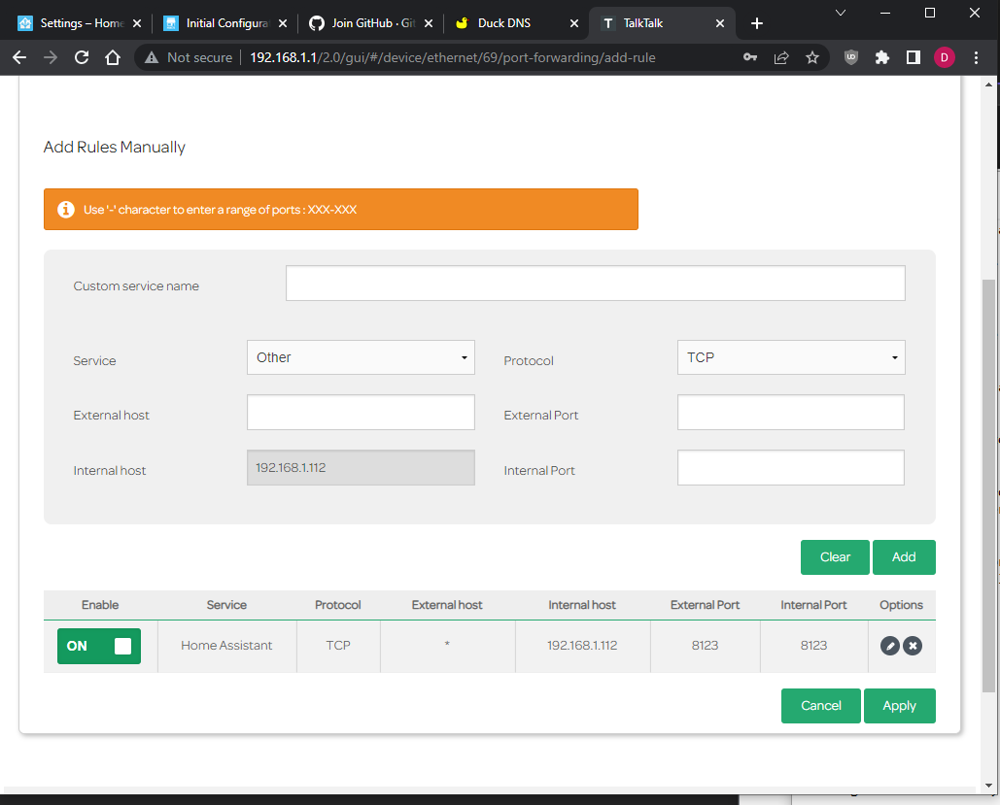
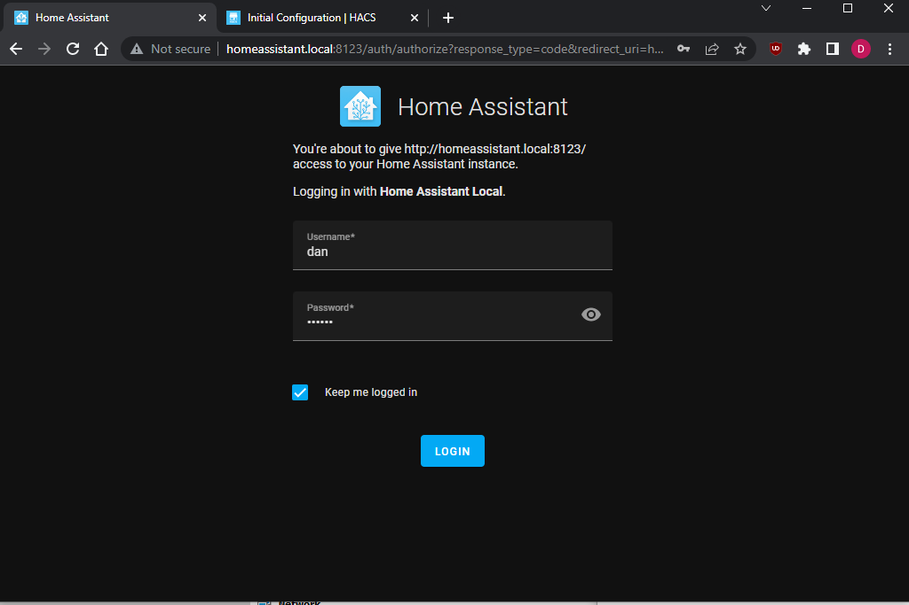
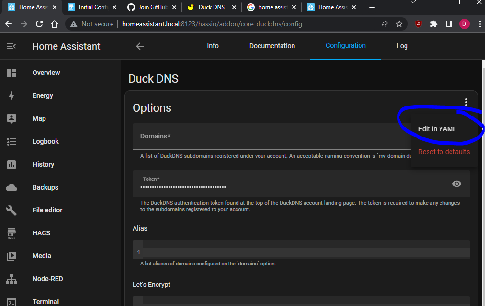

# Integrating Sofar2mqtt with Home Assistant
## Full instructions to get going with a Sofar2mqtt, Raspberry Pi and Home Assistant.

## Prerequisites
### Sofar2mqtt
Build or obtain a [Sofar2mqtt](https://github.com/cmcgerty/Sofar2mqtt)

I recommend you utilise the 3.3v MAX3485 (Red module) if building this yourself.  I also recommend the screen.  The screen isn't required but it at least provides some initial feedback about whether your build is working.  In short, spend the money and spend less time debugging!

### Obtain a [Raspberry Pi 4 Model B](https://thepihut.com/products/raspberry-pi-starter-kit?variant=20336446079038) - Preferably 4Gb.

I recommend you use Facebook Marketplace for local deals, however, I personally use a [Pi 400 4Gb](https://cpc.farnell.com/raspberry-pi/rpi400-kit-uk/raspberry-pi-400-kit-uk/dp/SC15825?CMP=TREML007-005&fbclid=IwAR0FnhpZ6vZ6hfrmIsEBRuoC5Vwq5PgEHoUJa1dkZE5jQ06H3SgkhRzrS6A)

The 400 is identical to the plain Raspberry Pi 4 Model B, however you don't need to build and case the device, and it comes with an integrated and keyboard in mouse to save you needing to source separate ones.  It is still small enough to tuck to one side once it is all up and running.

### Create a file called 'setup.txt' for notes

Save it to your desktop, open it in Notepad and have it ready throughout this guide to save account details and links and tokens as you go along.

## Accounts you will need to create if you don't already have

### [Google](https://www.google.co.uk/)
Google is more than just a search engine, with an account you are entitled to free storage called Google Drive, an email address and much much more.  You probably have one, but if not, sign up using the link in the header.  Add these details to your 'setup.txt'

We will be leveraging Google to store automated daily Home Assistant backups so that in the case of memory card failure, you can easily restore as was.

### [GitHub](https://github.com/)
GitHub is a source code management/collaboration tool, but it is also used for authentication purposes.  It is free and well renowed in the software development industry.

Sign up using the link in the header and the click Sign up at the top right of their page.

Follow the instructions to set up and activate your account.  Add these details to your 'setup.txt'

### [DuckDNS](https://duckdns.org/)
DuckDNS is a tool which gives you a static web address for your Internet connection.  Unless you have an extremely fancy Internet connection, every time your router reboots or disconnects from the Internet you will get a different IP address for your next connection.  This is the IP address which is used to present your local area network to the world.  The reason this is done is because there are a finite number of IP addresses and so IPs are dished out from a large pool and are re-used, rather than physically assigning one IP address to your router forever.  It would be a waste if lots of routers were not online and would contribute to IP address shortage.

So, with DuckDNS configured in Home Assistant later any change of IP address is recorded by DuckDNS and DuckDNS gives you a nice clean URL such as http://mysuperhomeassistantinstall.duckdns.org regardless of what your IP changes to.

Sign up using the link in the header.  Click 'Sign in with GitHub' or 'Sign in with Google' and follow the instructions to set up and activate your account.  Add these details to your 'setup.txt'

Once logged in, find the domains section and type in an address.  This will be used for your Home Assistant.  I am going to be using http://mydan-dan-ha.duckdns.org

I recommend you type something fairly unique and something relatively easy.  Don't be surprised if you type in something common - as it will be already used by someone else!

Click 'add domain' in green.

And it will be added to your account:

At the top of your account, please take note of your token and add these details to your 'setup.txt', it will be in the form
aaaaaaaa-aaaa-aaaa-aaaa-aaaaaaaaaaaa

You can close DuckDNS for now.

## Install Home Assistant
### Install Home Assistant
This guide assumes you have a Raspberry Pi and are leveraging Home Assistant Operating System.  As such, navigate to https://www.home-assistant.io/installation/ and scroll down to Raspberry Pi and click it.  Alternatively, navigate directly to https://www.home-assistant.io/installation/raspberrypi

Follow the instructions to utilise Balena Etcher to flash your Raspberry Pi's memory card with the 64-bit edition of Home Assisant OS.  At the time of writing, the version is 9.4, URL is https://github.com/home-assistant/operating-system/releases/download/9.4/haos_rpi4-64-9.4.img.xz

You will need your Raspberry Pi to be hard-wired to your router via an Ethernet cable in the first instance.  This guide will concentrate on utilising an Ethernet cable throughout, but it will cover how to swap over to Wi-Fi once everything is up and running.

Once flashed, put the memory card in your Raspberry Pi and boot it up.

You will see quite a lot of text scrolling along the screen as it boots up, however once finished you will be presented with the following screen:

Highlighted in this pic are two elements, first is the Local IP address dedicated to your Raspberry Pi by your router.  The second is the URL which you can use to access Home Assistant on your local network via a phone, tablet or computer.

As such, open Chrome or any browser of your choice and navigate to http://homeassistant.local:8123/ or in my case, I can navigate to http://192.168.1.112:8123/ as that is the Local IP address given to my Raspberry Pi by your router.  Your Local IP address will undoubtedly be different to mine.

Your IP (in my case 192.168.1.112) should be added to your 'setup.txt' file as Sofar2mqtt will need this to post inverter messages later.

## Configuring your Router
### Configuring your Router
We need to ensure that

- Your Raspberry Pi always gets given the same Local IP address, in my case 192.168.1.112, every time it is booted up.  Your router will work like your Internet IP and re-use IP addresses from a pool for the same reasons of IP address shortage.

- Open up port 8123 (the bit after the colon in the address above) to the outside world so you can access your Home Assistant from anywhere.

I am on TalkTalk so although my steps will be unique to TalkTalk users, the principles are the same.

Navigate to your Router's IP in chrome, usually http://192.168.1.1 or http://192.168.1.254

It will ask you to log in and the username and password is usually on a sticker on the back of your router.

Click into an area of your router's configuration which deals with your connected devices.

In my case this is called 'Manage my devices' but could be known as 'Local Network', etc.

And sure enough, I can see my homeassistant device:

I click on Advanced so I can change settings, and click into homeassistant:

I can click 'Reserve IP' to ensure that my homeassistant always gets the same address and click Apply:

I can click in Port Forwarding to configure the appropriate port to be opened to the outside world.

I will type in a Custom service name of Home Assistant

Leave Protocol as TCP

Leave External host empty

Type 8123 into External Port

and type 8123 into Internal Port

Click Add

Click Apply to finish

You can close your router's configuration page now.

## Initial Setup of Home Assistant
Once I go to that address, I am greeted with:

I am going to configure my system with some example details:
- Name: Dan
- Username: dan
- Password: mypass
- Confirm Password: mypass

And I'll click Create Account

You should use your full name and a username and password which are secure enough not to be guessed (as your Raspberry Pi will be open to the outside world) and you should add them to your 'setup.txt' so that they aren't forgotten.

The next screen will prompt you for a name, I'd leave it as default for Home because Home Assistant doesn't just cover off linking to Sofar2mqtt, it can also drive any Hue bulbs you may have, Google Nest products and a whole reap of other home automation kit.

I highly recommend you complete where you live, as this will also help solar predictions and ensure your time zones remain correct for Winter and Summer, if you are in the UK think Economy 7 / Octopus Go charging times.  Click Next

Choose whether or not you are happy sharing stats and click Next

And the final step will show any services already found on the network.  You can see here it has picked up my HomeKit, Google Cast, Office HomePod and Philips Hue lighting.  We don't want to configure those yet so just click Finish.

Now you are in and ready with a fresh install of Home Assistant!

We have plenty to configure now, so let's get to it.

## Configuring Home Assistant - Advanced Mode

### Advanced Mode
Click your name at the bottom left, scroll down and click 'Advanced Mode'

## Configuring Home Assistant - Add-ons

Click Settings at the bottom left

Click Add-ons

The screen will be empty with an ADD-ON STORE button at the bottom right.  Click it.

### DuckDNS
Find and click DuckDNS and click INSTALL and wait until completed.  Once completed you'll have a START or UNINSTALL option.

Just click the back arrow

### File editor
Find and click File editor and click INSTALL and wait until completed.  Once completed you'll have a START or UNINSTALL option.

Click 'Show in sidebar'

Just click the back arrow

### Mosquitto broker
Find and click Mosquitto broker and click INSTALL and wait until completed.  Once completed you'll have a START or UNINSTALL option.

Just click the back arrow

### Node-RED
Find and click Node-RED and click INSTALL and wait until completed.  Once completed you'll have a START or UNINSTALL option.

Click 'Show in sidebar'

Click the 'Configuration' tab

Copy and paste MySecretPa$$Word into the credential_secret box

UNTICK ssl

Click SAVE

Just click the back arrow

### Google Drive Backup
As per https://github.com/sabeechen/hassio-google-drive-backup

At the top right of the 'Add-on Store' there is a three dot menu button.  Click it and click 'Respositories'

Type

https://github.com/sabeechen/hassio-google-drive-backup

into the box and click ADD

Then click CLOSE

Refresh the window by pressing F5 on your keyboard

Find and click 'Home Assistant Google Drive Backup' (at the bottom of the store usually) and click INSTALL and wait until completed.  Once completed you'll have a START or UNINSTALL option.

Click 'Show in sidebar'

Just click the back arrow

### Terminal & SSH
Find and click Terminal & SSH and click INSTALL and wait until completed.  Once completed you'll have a START or UNINSTALL option.

Click 'Show in sidebar'

Click 'START'

Just click the back arrow

### HACS
We will now be installing HACS for some extra fun such as chart types.  The download link for HACS is https://hacs.xyz/docs/setup/download and we will be following the OS/Supervised route.  However, as we have done most of the heavy lifting all we need to do is

Click 'Terminal' on the left

You will be prompted with a terminal interface to type commands.

Type in

wget -O - https://get.hacs.xyz | bash -

Include that minus at the end and that is a capital O, not zero (0).

Once completed you should see something like this:

As you can see, it is recommending you restart.  So we will do that now.  Click on Developer Tools on the left and click 'RESTART' in red and click RESTART again to confirm.

Wait a while and Home Assistant will be back up and running where you left off.

We need to hard refresh your browser, so in the case of Chrome and most other browsers, hold Control and press F5 on the keyboard.  It will ask you to log back in.  Use your username and password from earlier.  I recommend you tick the 'Keep me logged in' box.

Click Settings on the left and click Devices & Services

Click the blue + ADD INTEGRATION at the bottom right.

Scroll down the list to HACS and click it.  You will be prompted for several tickboxes you need to tick.

Tick them all and click SUBMIT.

It will prompt to authorise the device with GitHub.  It's a good job we created an account earlier.

Log in with your details and type in the code and click Continue

HACSCode.PNG

Click the green 'Authorise hacs' button.

You can close the Device Activation window and in Home Assistant you will see

Just click Finish.

## Configure Addons
OK, let's configure all these Add-ons

Click Settings on the left, click Add-ons and you will see the complete list:

Where the icon is black and white, it means it isn't yet running.  You will see Terminal & SSH is coloured in because we started it to install HACS via the terminal interface.

### Duck DNS:
Click on Duck DNS

Click Configuration at the top

Firstly, you will see a blank domain with an X at the top, delete it by clicking X.

Take the address you configured in DuckDNS in its entirety, in my case, mydan-dan-ha.duckdns.org and get your DuckDNS token which should be in your 'setup.txt' into Token.

The configuration page at the time of writing is broken, so click the three dots at the top right of Options and click 'Edit in YAML'

In the square brackets in domains:, paste in your address from DuckDNS without the http://, i.e. mydan-dan-ha.duckdns.org

Within the quotes for token:, paste in your token from DuckDNS.

Click 'SAVE'

Click the Info tab at the top and click START.

When started, click the Log tab at the top and if successful, you will see a message in green either indicating there's no change, or that it was successfully updated.  If it hasn't worked, double check your address, your token, and try again.

### File editor:
Click back to go back to the Add-ons list.
Click on File editor
Click START.
FileEditorStarted.PNG

Home Assistant Google Drive Backup:
Click back to go back to the Add-ons list.
Click on Home Assistant Google Drive Backup
Click START.
GoogleDriveStarted.PNG

On the left hand menu, click Backups and you will be prompted to Authenticate with Google Drive.
GoogleDriveSetup.PNG

Click AUTHENTICATE WITH GOOGLE DRIVE
You may need to sign into your Google account, so do so.  Click 'Continue' to allow habackup.io to access your drive.
It will give you an Authorization String:
AuthorizationString.PNG

Click the COPY button
Go back to your Home Assistant screen and paste it into the box and click SAVE.
If all is good, you will be prompted with the following:
BackupComplete.PNG

If the code fails, please check what you pasted and try again.

Node-RED:
Click Settings on the left menu and click Add-ons to go back to the Add-Ons list.
Click Node-RED.
Click START.
NodeRedStarted.PNG

Mosquitto broker:
Click the back arrow to go back to the Add-ons list.
Click Mosquitto broker
Click the Configuration tab.

In Logins, paste the following, including the hypen:
- username: battery
  password: Switch1

battery and Switch1 should be added to your 'setup.txt' file as Sofar2mqtt will need this to post inverter messages.
You can of course choose a different username or password, but this is quite safe for the job.
MosquittoSetup.PNG

Click the blue SAVE button.
Click the Info tab at the top.
Click START
MosquittoStarted.PNG

Click the Log tab at the top.  If everything has worked right you should see green messages indicating success.  If not, go back to configuration and check your username and password text box.
MosquittoDone.PNG

That's all the Add-ons configured for now.

HACS Configuration
Click HACS on the left hand side
Click Integrations
and then click the Frontend tab.
HACSIntegrationsFrontEnd.PNG

Click the blue + EXPLORE & DOWNLOAD REPOSITORIES
We will be installing the following

card-mod:
Type in card-mod in the 'Search for repository' box
CardMod.PNG
Click it in when it appears in the list
Click the blue DOWNLOAD button
And click DOWNLOAD in the popup window.  Wait for the install.  Click RELOAD.

layout-card:
Click HACS on the left hand side
Click Integrations
and then click the Frontend tab.
Click the blue + EXPLORE & DOWNLOAD REPOSITORIES
Type in layout-card in the 'Search for repository' box
LayoutCard.PNG
Click it in when it appears in the list
Click the blue DOWNLOAD button
And click DOWNLOAD in the popup window.  Wait for the install.  Click RELOAD.

apexcharts-card:
Click HACS on the left hand side
Click Integrations
and then click the Frontend tab.
Click the blue + EXPLORE & DOWNLOAD REPOSITORIES
Type in apexcharts-card in the 'Search for repository' box
ApexChartsCard.PNG
Click it in when it appears in the list
Click the blue DOWNLOAD button
And click DOWNLOAD in the popup window.  Wait for the install.  Click RELOAD.

apexcharts-card:
Click HACS on the left hand side
Click Integrations
and then click the Frontend tab.
Click the blue + EXPLORE & DOWNLOAD REPOSITORIES
Type in apexcharts-card in the 'Search for repository' box
ApexChartsCard.PNG
Click it in when it appears in the list
Click the blue DOWNLOAD button
And click DOWNLOAD in the popup window.  Wait for the install.  Click RELOAD.

Power Flow Card:
Click HACS on the left hand side
Click Integrations
and then click the Frontend tab.
Click the blue + EXPLORE & DOWNLOAD REPOSITORIES
Type in Power Flow Card in the 'Search for repository' box
PowerFlowCard.PNG
Click it in when it appears in the list
Click the blue DOWNLOAD button
And click DOWNLOAD in the popup window.  Wait for the install.  Click RELOAD.

Sankey Chart Card:
Click HACS on the left hand side
Click Integrations
and then click the Frontend tab.
Click the blue + EXPLORE & DOWNLOAD REPOSITORIES
Type in Sankey Chart Card in the 'Search for repository' box
SankeyChartCrd.PNG
Click it in when it appears in the list
Click the blue DOWNLOAD button
And click DOWNLOAD in the popup window.  Wait for the install.  Click RELOAD.

Add-on configuration is now complete.

Sofar2mqtt
Now, we need to take the details of our Mosquitto broker now running on our Home Assistant box and plumb them into Sofar2mqtt.

From your 'setup.txt' file, you should have the Local IP Address of your Raspberry Pi.  In my case this was
192.168.1.112
You should also have the username and password we configured in Mosquitto.  In my case this was
Username: battery
Password: Switch1

I am assuming you have followed the build and configuration instructions on the Sofar2mqtt site, and that you have Arduino open with Sofar2mqtt.ino ready in there.

* One thing Sofar2mqtt does not mention is D1mini drivers.  Install the drivers from https://www.wemos.cc/en/latest/ch340_driver.html

Editing Sofar2mqtt.ino

At the top of the code there are definitions you need to configure based on what we have just done.
If you are using an ME3000 then ensure the ME3000 line begins #define and that the HYBRID line begins //.
If you are using a HYBRID then ensure the ME3000 line begins with // and that the HYBRID line begins #define.

Type in your Wi-Fi name between the quotes for WIFI_SSID
Type in your Wi-Fi password between the quotes for WIFI_PASSWORD
Type in your Local IP Address of your Raspberry Pi between the quotes for WIFI_PASSWORD
Type in your Username you configured in Mosquitto earlier for MQTT_USERNAME, we used battery
Type in your Password you configured in Mosquitto earlier for MQTT_PASSWORD, we used Switch1

SofarConfig.PNG

Save this as Sofar2mqtt-customised.ino, that way you have this file to fall back to pre-configured with your details.
* Remember, if your Wi-Fi changes, you will need to update the WIFI_SSID and WIFI_PASSWORD to suit the new router.
* Remember, if your Raspberry Pi changes, you will need to update MQTT_SERVER, MQTT_USERNAME and MQTT_PASSWORD to suit your new config.

Flash this using the Sketch -> Upload menu.

Node-RED - Sofar2mqtt.json

This flow imports the data from Sofar2mqtt and presents the results to Home Assistant as sensors.

Download Sofar2mqtt.json from this GitHub repository
Click Node-RED on the left hand side
After a pause, you will be greeted with the Intro:
NodeRedIntro.PNG

Skip through the intro
At the top right, click the three-line menu burger and click Import
NodeRedIMPORT.PNG

Click 'select a file to import' and browse to the Sofar2mqtt.json downloaded a few steps ago.
Click 'new flow' for Import to
Click Import
The flow will appear in the right hand side, and also in a tab at the top.  Click the tab:
SofarFlow.PNG

We just need to configure the Mosquitto details and we are done.
Double click the purple Sofar2MQTT node on the left and the following properties screen will open:
SofarFlowConfig1.PNG

Click the Pencil alongside 'Home Assistant Mosquitto'
Click on the 'Security' tab and type in our Mosquitto username and password configured earlier.
In my case, these were battery and Switch1
BrokerNodeConfig.PNG

Click Update
Click Done

Click Deploy at the top right.  Once deployed, you will see that the MQTT node Sofar2MQTT has connected:
BrokerConnected.PNG

OPTIONAL Node-Red Economy7Management.json

This flow will automatically charge the battery to 100% and keep the load powered by the grid until the end of the Economy 7 time period.  This is useful if you are leveraging Econonmy 7 and also within winter months where solar generation is poor.

At the top right, click the three-line menu burger and click Import
NodeRedIMPORT.PNG

Click 'select a file to import' and browse to the Economy7Management.json downloaded a few steps ago.
Click 'new flow' for Import to
Click Import
It may moan about copy of nodes, choose 'Import Copy'
The flow will appear in the right hand side, and also in a tab at the top.  Click the tab:
SofarFlow.PNG

We just need to verify your Economy 7 or Octopus Go times.  Double click the orange Format node and the following properties screen will open:
E7Setup.PNG
Scroll down to the part of the code shown in the screenshot above to configure your cheap rate tariff.  It is defaulted to 00:35 and 07:25.
Click Done
Click Deploy at the top right.  Once deployed, you will see that the MQTT node Sofar2MQTT has connected:
E7Connected.PNG

MQTT Integration
We need to connect Home Assistant to our Mosquitto broker which runs alongside it.  We do this like so:
Click on Settings on the left hand side
Click Devices & Services
Click the CONFIGURE button under MQTT:
MQTTIntegration.PNG

It will prompt 'Do you want to configure Home Assistant to connect to the MQTT broker provided by the add-on Mosquitto broker?'
Click SUBMIT
It will then auto-configure for Mosquitto and leave you with the following:
BrokerConfigured.PNG

configuration.yaml

The configuration.yaml is the file which contains all the Home Assistant configuration.  We will take a backup of it now.

Click File editor on the left hand side
Click the white folder icon at the top left
Click on configuration.yaml in the config/ folder:
ConfigurationYaml.PNG

In the right hand side you will see it is a pretty simple config at this stage.  To save it locally, copy and paste the contents to a new Notepad and save the file to your desktop as configuration-backup-2023-01-06.yaml.  Change 2023-01-06 to reflect the yyyy-mm-dd you are doing this.  This is just a safeguard.

Download the configuration.yaml from this GitHub Repository
Open the file in Notepad
Copy all the contents using Edit -> Select All and copy using Edit -> Copy
Back in Home Assistant, delete the contents in the window already:

ConfigEmpty.PNG

and paste the contents so it looks like this
ConfigPasted.PNG

Click the reddy-orange SAVE button at the top right.
Click 'Developer Tools' on the left hand side and click 'Check Configuration' and if all is good you should get a green message:
ConfigSuccess.PNG

Click RESTART and confirm by clicking RESTART in the confirmation box.

Once back up and running, we only have dashboards to configure!

Dashboards:
There are two dashboards, one which shows all information in real-time.  The second is to do with inverter control.

Real-Time Info:
Click on Settings and then click on Dashboards
Click + ADD DASHBOARD at the bottom right.
AddDashboard.PNG

Configure a dashboard called SOFAR
Choose an icon, i used mdi:solar-panel
And ensure Show in sidebar is ticked

CreateDashboardSOFAR.PNG

Click Create

Click SOFAR which will now be at the top left hand side.  Click the three dots on the far right side and click Edit Dashboard
EditDashboard.PNG

Tick 'Start with an empty dashboard' and then 'TAKE CONTROL'
TakeControl.PNG

Click the three dots at the top right and click 'Raw configuration editor'
RawConfig.PNG

Select all the text currently in there and get rid.
Open SofarDashboard.txt from this repository in Notepad and copy and paste the contents into the window like so:
SofarDashboard.PNG

Click SAVE at the top right
Press the X at the top left
Then click DONE at the top right

Your dashboard shouldn't look too far away from the following:
SOFAR1Example.PNG

Clicking on TODAY'S POWER DIAGRAM will give you today's picture in a graph:
Today.PNG

If you get a problem on any of the tabs, for example the TODAY'S POWER DIAGRAM you may see 'Custom element doesn't exist: apexcharts-card' then I found this just to be a bug in HACS.
To overcome, click on HACS on the left hand menu
Click Frontend
You will see all the elements which are Not Loaded in red:
NotLoaded.PNG

Click on any
Click the three dots menu at the top right
Click Redownload
Redownload.PNG
And click Download in the popup
When done, click RELOAD

Repeat for all other unloaded elements.

Inverter Control:
Click on Settings and then click on Dashboards
Click + ADD DASHBOARD at the bottom right.
AddDashboard.PNG

Configure a dashboard called Inverter Control
Choose an icon, i used mdi:remote
And ensure Show in sidebar is ticked
Click Create

Click Inverter Control which will now be at the top left hand side.  Click the three dots on the far right side and click Edit Dashboard
EditDashboard2.PNG

Tick 'Start with an empty dashboard' and then 'TAKE CONTROL'
TakeControl.PNG

Click the three dots at the top right and click 'Raw configuration editor' as before.

Select all the text currently in there and get rid.
Open InverterControlDashboard.txt from this repository in Notepad and copy and paste the contents into the window like so:
SofarDashboard.PNG

Click SAVE at the top right
Press the X at the top left
Then click DONE at the top right

Your dashboard shouldn't look too far away from the following:
InverterControl.PNG

If you want to access Home Assistant on your phone or tablet, download the Home Assistant App or use your appropriate web browser.

If using a web browser, simply browse to your DuckDNS URL when away from home
For example, I will use http://mydan-dan-ha.duckdns.org:8123

RemoteURL.PNG
RemoteLogin.PNG
RemoteDashboard.PNG

If your router is smart it will also work if you are on Wi-Fi.  If not (like me), you will need a second bookmark of Local IP:8123
For example, I will use http://192.168.1.112:8123

LocalLink.PNG
LocalLogin.PNG
LocalDashboard.PNG

When using the app, it is a similar configuration, simply use the addresses as configured and the appropriate username and password.

Queries?
Contact.

